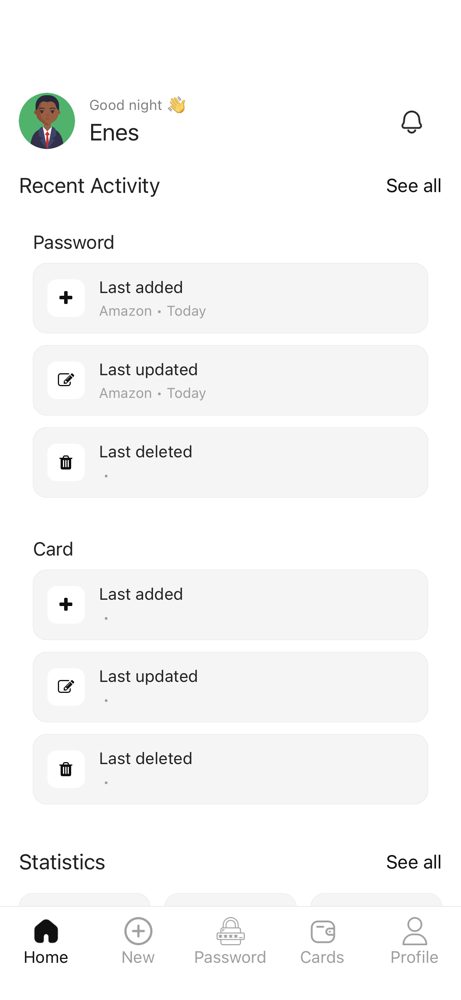
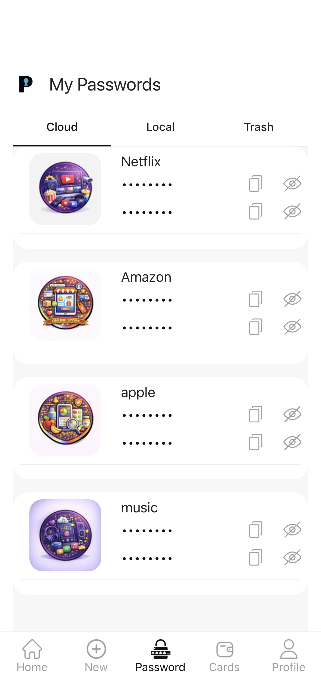
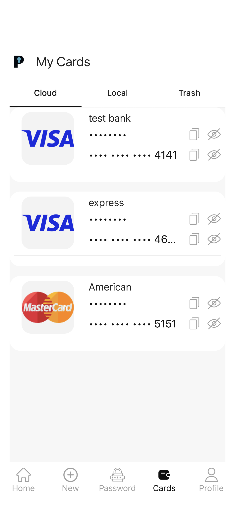
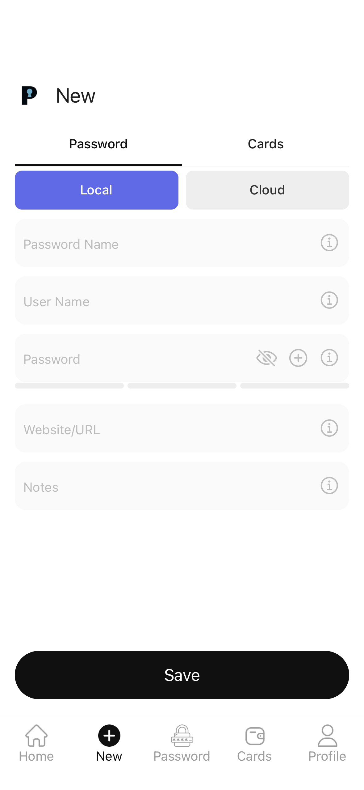
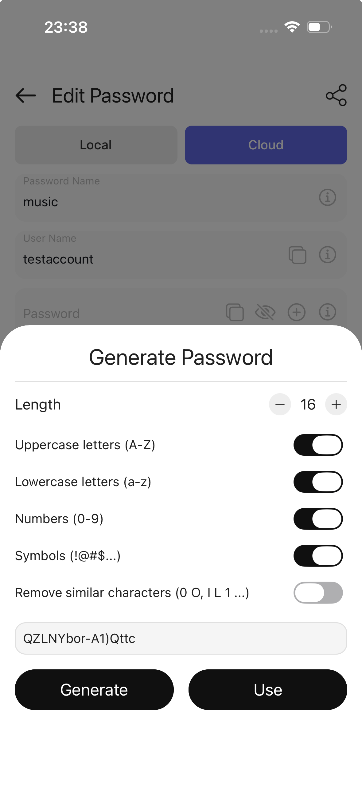
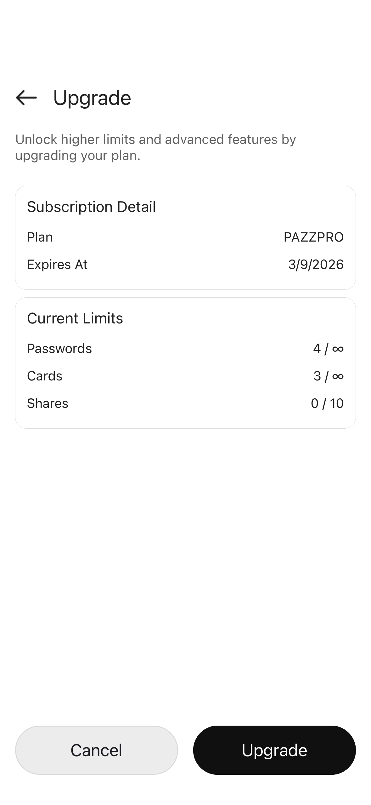

# Pazzwrd Client

Pazzwrd is a mobile password manager built with React Native and Expo. It helps users store passwords and cards, generate strong credentials, manage local and cloud vaults, and protect access with biometric and security-focused flows.

This repository contains the mobile client application.

## What the app does

- Store passwords in local or cloud-backed vaults
- Save and manage payment cards
- Generate strong passwords with configurable rules
- Copy, reveal, edit, move, and organize sensitive items
- Protect access with Master Password and biometric flows
- Support subscriptions, plan limits, and multi-language UI

## Screenshots

<p align="center">
  
  
  
</p>

<p align="center">
  
  
  
</p>

## Main features

- Password vault
  Save website credentials, usernames, passwords, URLs, and notes.
- Card vault
  Store card holder data, masked card numbers, and related payment details.
- Local and cloud flows
  The app supports both device-local items and cloud-synced items depending on account state and plan limits.
- Password generator
  Generate passwords with length and character-set controls.
- Security-first UX
  Includes Master Password, biometric flows, secure storage usage, and screenshot protection logic.
- Sharing and plan-based limits
  Shared-item flows and subscription/upgrade screens are part of the client.
- Internationalization
  The UI ships with multiple languages and device-language bootstrap logic.

## Stack

- React Native
- Expo
- TypeScript
- React Navigation / Expo Router
- React Query
- i18next

## Project structure

```text
api/           API client modules
components/    Shared UI components
hooks/         Data and feature hooks
i18n/          i18n bootstrap
locales/       Translation files
screens/       Screen-level flows
store/         App contexts and state
tabs/          Main tab content
utils/         Helpers, security, storage, sync utilities
```

## Getting started

### 1. Install dependencies

```bash
npm install
```

### 2. Configure env vars

Copy the example file and fill in your own values:

```bash
cp .env.example .env
```

Important notes:

- `.env` is intentionally ignored and should not be committed.
- Google Sign-In and RevenueCat require your own project credentials.
- The app config uses environment variables for identifiers such as bundle/package names and Expo project metadata.

### 3. Run the app

```bash
npm start
```

Native runs:

```bash
npm run ios
npm run android
```

## Environment variables

Common variables used by the client:

- `EXPO_PUBLIC_API_URL`
- `EXPO_PUBLIC_GOOGLE_IOS_CLIENT_ID`
- `EXPO_PUBLIC_GOOGLE_ANDROID_CLIENT_ID`
- `EXPO_PUBLIC_GOOGLE_WEB_CLIENT_ID`
- `EXPO_PUBLIC_RC_IOS_API_KEY`
- `EXPO_PUBLIC_RC_ANDROID_API_KEY`
- `EXPO_PUBLIC_RC_DEFAULT_OFFERING_ID`
- `EXPO_PUBLIC_RC_PRODUCT_PRO_MONTHLY`
- `EXPO_PUBLIC_RC_PRODUCT_PRO_YEARLY`
- `EXPO_PUBLIC_RC_PRODUCT_FAMILY_MONTHLY`
- `EXPO_PUBLIC_RC_PRODUCT_FAMILY_YEARLY`
- `EXPO_APP_NAME`
- `EXPO_APP_SLUG`
- `EXPO_APP_SCHEME`
- `EXPO_IOS_BUNDLE_IDENTIFIER`
- `EXPO_ANDROID_PACKAGE`
- `EXPO_EAS_PROJECT_ID`
- `EXPO_OWNER`

See [.env.example](.env.example) for the full template.

## Security and native notes

- Face ID / biometrics require a native build to fully reflect app config changes.
- Expo Go does not fully represent all native security-related configuration.
- Social sign-in and billing integrations are optional until their env values are configured.

## Scripts

```bash
npm start
npm run ios
npm run android
npm run typecheck
npm run lint
npm run format
```

## Screenshots source

README screenshots are stored in [docs/screenshots](docs/screenshots).
